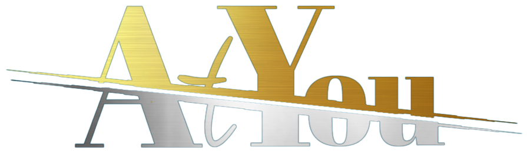

 

<em>Automatically Transcript Youtube</em>

<strong>A WebApp that extracts text from youtube videos and give out summarization.</strong>

> Part of the project [OpenAI Whisper, GPT3, Codex & DALL-E 2 Hackathon](https://lablab.ai/event/openai-whisper-gpt3-codex-dalle2-hackathon)

## Tools used

- [OpenAI](https://beta.openai.com/)
- [AssemblyAI](https://www.assemblyai.com/)
- [YoutTubeAPI](https://www.google.com/search?channel=fs&client=ubuntu&q=youtubeapi)

### Running Locally

- git clone the repo
- ``pip install -r requirements.txt``
- create [YoutTubeAPI](https://www.google.com/search?channel=fs&client=ubuntu&q=youtubeapi) and [OpenAI](https://beta.openai.com/) account
- create ``.env`` file inside project directory and write
        ``OPENAI_KEY=<your_openai_key>``
       `` YOUTUBE_KEY=<your_youtube_key>``
- run ``python main.py``